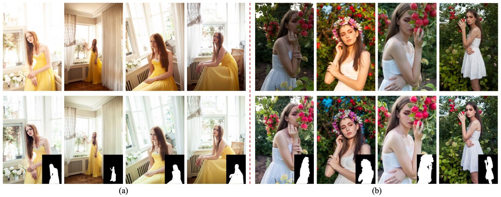

# Portrait Photo Retouching with PPR10K

### [Paper]() |   [Supplementary Material]()

> **PPR10K: A Large-Scale Portrait Photo Retouching Dataset with Human-Region Mask and Group-Level Consistency** <br>
> [Jie Liang](liangjie.xyz)\*, Hui Zeng\*, Miaomiao Cui, Xuansong Xie and [Lei Zhang](https://www4.comp.polyu.edu.hk/~cslzhang/). <br>
> In CVPR 2021.

PPR10K contains 1,681 groups and 11,161 high-quality raw portrait photos in total. 
High-resolution segmentation masks of human regions are provided. 
Each raw photo is retouched by three experts, while they elaborately adjust each group of photos to have consistent tones.

### Samples and Motivations



Examples of a group of photos from the PPR10K dataset.
**Top**: the raw photos; 
**Bottom**: the retouched results from one expert and the human-region masks.
The raw photos exhibit poor visual quality and large variance in subject views, background contexts, 
lighting conditions and camera settings. 
The retouched results demonstrate both good visual quality (with human-region priority) and group-level consistency.

### Agreement

- All files in the PPR10K dataset are available for ***non-commercial research purposes*** only.

### Overview

All data is hosted on [Baidu Drive](https://pan.baidu.com/s/1hpMO__JIvqWImdL8rznYcw) (Password: wu03):

| Path | Size | Files | Format | Description
| :--- | :---: | ----: | :----: | :----------
| [PPR10K-dataset](https://pan.baidu.com/s/1hpMO__JIvqWImdL8rznYcw) | 345 GB | 122,810 | | Main folder
| &boxvr;&nbsp; raw | 313 GB | 11,161 | RAW | All photos in raw format (.CR2, .NEF, .ARW, etc)
| &boxvr;&nbsp; xmp_source | 130 MB | 11,161 | XMP | Default meta-file of the raw photos in CameraRaw, used in our [data augmentation]()
| &boxvr;&nbsp; xmp_target_a | 130 MB | 11,161 | XMP | Meta-file of the raw photos retouched by the expert a
| &boxvr;&nbsp; xmp_target_b | 130 MB | 11,161 | XMP | Meta-file of the raw photos retouched by the expert b
| &boxvr;&nbsp; xmp_target_c | 130 MB | 11,161 | XMP | Meta-file of the raw photos retouched by the expert c
| &boxvr;&nbsp; masks_full | 697 MB | 11,161 | PNG | Full-resolution human-region masks in binary format
| &boxvr;&nbsp; masks_360p | 56 MB | 11,161 | PNG | 360p human-region masks for fast training and validation
| &boxvr;&nbsp; train_val_images_tif_360p | 32 GB | 44644 | TIF | 360p Source (16 bit tiff) and target (8 bit tiff) images for fast training and validation
| &boxur;&nbsp; hists | 624KB | 39 | PNG | Overall statistics of the dataset

One can directly use the 360p (540x360 or 360x540) training and validation files (photos and the corresponding human-region masks) we have provided following the settings in our paper. <br>
Also, see the [instructions](docs/dataset_usage.md) to customize your data (e.g., augment the training samples, get photos with hiogher or full resolutions).

### Training and Validating the PPR using [3DLUT](https://github.com/HuiZeng/Image-Adaptive-3DLUT)

#### Installation

- Clone this repo.
```bash
git clone https://github.com/csjliang/PPR10K
cd PPR10K/3DLUT_PPR10K/
```

- Install dependencies.
```bash
pip install -r requirements.txt
```

- Build. Modify the CUDA path in ```trilinear_cpp/setup.sh``` adaptively and
```bash
cd trilinear_cpp
sh trilinear_cpp/setup.sh
```

#### Training

- Training without GLC strategy and save models:
```bash
python multi_LUTs_paper.py
```

- Training with GLC strategy and save models:
```bash
python multi_LUTs_paper_GLC.py
```

#### Evaluation

- Generate the retouched results:
```bash
python multi_LUTs_paper_evaluation.py
```

- Use matlab to calculate the measures in our paper:
```bash
../MATLAB/calculate_metrics.m
```

### Training and Validating the PPR using [Parameter Regression](Parameter_Regression)

### Citation
If you use this dataset and code for your research, please cite our paper.
```
@inproceedings{park2019SPADE,
  title={PPR10K: A Large-Scale Portrait Photo Retouching Dataset with Human-Region Mask and Group-Level Consistency},
  author={Liang, Jie and Zeng, Hui and Cui, Miaomiao and Xie, Xuansong and Zhang, Lei},
  booktitle={Proceedings of the IEEE Conference on Computer Vision and Pattern Recognition},
  year={2021}
}
```
